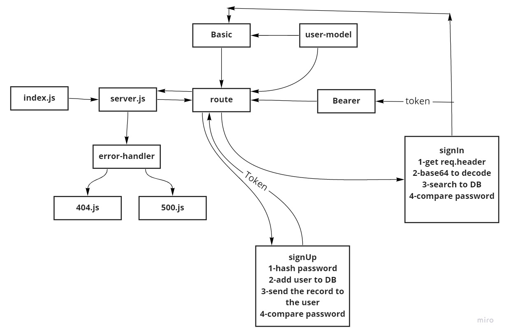

# bearer-auth

## Test CI:
[URL](https://github.com/AyahZaareer/bearer-auth/actions)

## Heroku Link:
[URL](https://ayah-bearer-auth.herokuapp.com)

## Pull Request:
[URL](https://github.com/AyahZaareer/bearer-auth/pull/5)

## Setup:
1.clone the repo.
2.npm init -y.
3.npm exprees,dotenv,mongooes,cors,supuergooes,route,basic-64,bcrypt ,jsonwebtoken.

### Endpoint:
 - Auth routes for handling the login and authentication system:
   - POST /signup to create an account
   - POST /signin to login with Basic Auth

## Test:
.Unit test: npm test

## Run:
 - nodemon

 
